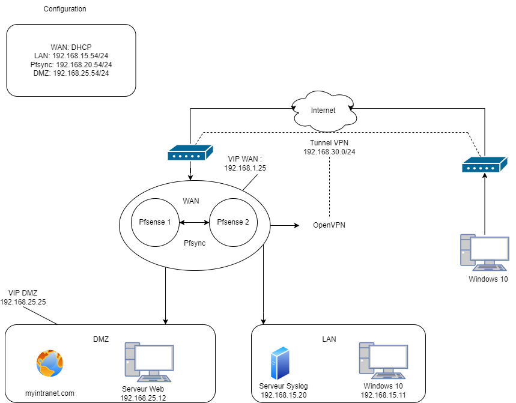

# Description Projet

 

### _Offrir un accès à l’intranet depuis l’extérieur._

#### - Utilisation d’une vrai IP publique 
- Derrière votre box  
- Location de serveur

#### - Gestion firewall pour autoriser l’accès extérieur

#### - Sécurité 
- redondance du serveur VPN
- Authentification des utilisateurs
- Attribution d’une IP fixe à chacun des utilisateurs (pour pouvoir tracer leurs actions avec leur IP)
- Logs
- Gestion de certificats

### _Maquette attendue_
- Documentation utilisateur (une procédure qu’on peut donner à un nouvel employé pour qu’il puisse se connecter au VPN)
- Une machine qui sert de serveur VPN, de préférence à domicile pour avoir une IP publique
- Un client qui se connecte avec succès au VPN
- Gestion des logs de connexion (rétention, archivage, purge)

> Idées Technos possibles (non exhaustif)•OpenVPN, OpenSwan, StrongSwan, etc.

### _Description Outils Utilisés_

### _Client_

- 1 machine client afin de se connecter au serveur VPN

### _Serveur_

- 4 machines virtuelles
    - pfSense afin de gérer le firewall
    - un deuxième pfSense pour la redondance afin d'éviter toute panne
    - un client qui nous permet d'accéder à l'interface pfSense (ici Windows 10)
    - une VM qui servira de serveur Web pour l'intranet (ici Ubuntu)

### Architecture de nos machines

