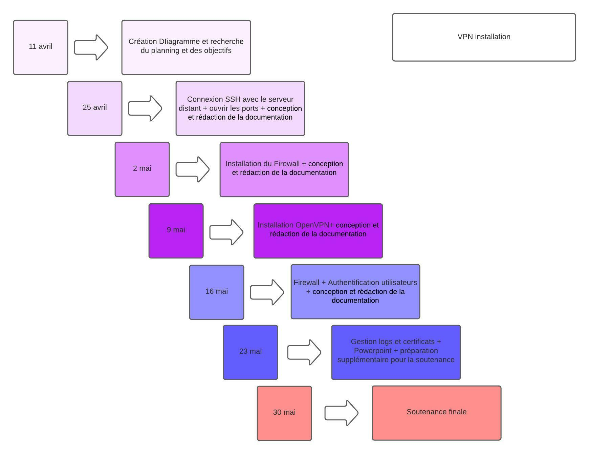

# Planning VPN

### _Diagramme de Gantt_

> Des changements sont à prévoir et sont mis à jour dans la liste ci-dessous, veuillez vous référer à cette liste pour un suivi plus précis du déroulement du projet.

### _Avancement projet_

11 avril 
- Création Diagramme et recherche du planning et des objectifs

25 avril
- Connexion SSH avec le serveur distant et conception et rédaction de la documentation Chapitre 0 et 1

2 mai
- Installation de OpenVPN et conception et rédaction de la documentation Chapitre 2 et 3 avec création des certificats
  
9 mai
- Installation du Firewall et des clés clients et conception et rédaction de la documentation Chapitre 4

16 mai
- Configuration OpenVPN et Authentification utilisateurs ainsi que la conception et rédaction de la documentation Chapitre 5 et 6 et 7 + Sommaire

23 mai
- Gestion logs et certificats et Powerpoint et préparation supplémentaire pour la soutenance ainsi que la fin de la rédaction de la documentation

30 mai
- Soutenance finale

