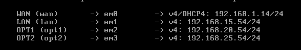
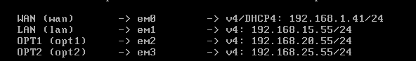

# Configuration du réseau

[](https://travis-ci.org/joemccann/dillinger)

## pfSense

Nous avons besoins de **4 cartes réseaux** pour chacun des pfSense.

- **WAN** doit être en bridge avec une IP en DHCP.
- **LAN** (LAN Segment de type pfsense_LAN)
    - Machine 1 : **192.168.15.54/24**
    - Machine 2 : **192.168.15.55/24**
- **OPT1** (LAN Segment de type PFSYNC pour la synchronisation de pfsense)
    - Machine 1 : **192.168.20.54/24**
    - Machine 2 : **192.168.20.55/24**
- **OPT2** (LAN Segment de type DMZ pour le serveur web)
    - Machine 1 : **192.168.25.54/24**
    - Machine 2 : **192.168.25.55/24**

### pfSense 1



### pfSense 2



## Windows 10

**Carte réseau** : LAN Segment pfsense_LAN car on doit pouvoir accéder à l'interface web du pfSense.
- **IP** : 192.168.15.11/24
- **Passerelle par défaut** : 192.168.15.54
- **DNS** : 192.168.15.54

## Serveur Web
**Carte réseau** : LAN Segment DMZ

Il faut tout d'abord installer Apache2.
```sh
sudo apt-get install apache2
```

Il faut maintenant éditer le fichier de configuration
```sh
sudo nano/etc/netplan/01-netcfg.yaml
```

Changer l'ip **addresses** en 192.168.25.12/24

Changer la passerelle **gateway4** en 192.168.25.25.

Pour valider, il faut relancer **netplan apply**
```sh
sudo netplan apply
```

Vous pouvez modifier la page par défaut d'apache en modifiant le fichier `/var/www/html/index.html`

Le client devrait maintenant pouvoir y accéder via l'IP **192.168.25.12**
