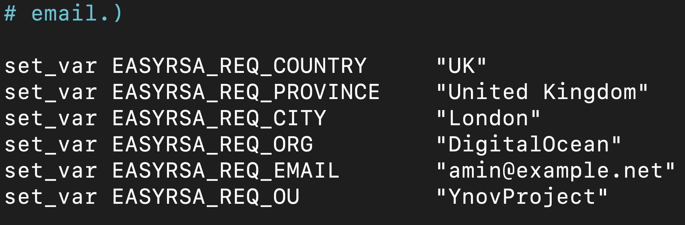

# OpenVPN

[](https://travis-ci.org/joemccann/dillinger)

### _Certificat_

Pour mettre en place une autorité de certification afin de pouvoir émettre nos propres certificats de confiance.

>Pour cela, il faut utiliser EasyRSA. Tout d’abord l’installer sur une seconde machine qui s’occupera uniquement de gérer les certificats.

#### Connexion seconde machine AC
````shell
ssh root@138.68.156.246
password: Passw0Rd
````

#### Installation EasyRSA sur machine AC

````shell
wget -P ~/ [https://github.com/OpenVPN/easy-rsa/releases/download/v3.0.4/EasyRSA-3.0.4.tgz](https://github.com/OpenVPN/easy-rsa/releases/download/v3.0.4/EasyRSA-3.0.4.tgz)
cd ~
tar xvf EasyRSA-3.0.4.tgz
````

Ensuite copier le fichier vars.example sans l’extension, puis on l’édite afin de modifier la configuration

````shell
cp vars.example vars
nano vars
````



Il faut maintenant exécuter un script qui va s’occuper de la gestion et de la configuration de l’AC.

````shell
./easyrsa init-pki
./easyrsa build-ca nopass
````
>2 nouveaux fichiers ont été créer

Le fichier certificat et la key
- _ca.crt_
- _ca.key_

### _Installation EasyRSA sur machine VPN_

````shell
wget -P ~/ [https://github.com/OpenVPN/easy-rsa/releases/download/v3.0.4/EasyRSA-3.0.4.tgz](https://github.com/OpenVPN/easy-rsa/releases/download/v3.0.4/EasyRSA-3.0.4.tgz)
cd ~
tar xvf EasyRSA-3.0.4.tgz
````

Il faut à nouveau exécuter le script car les 2 machines auront des répertoires PKI séparés

````shell
./easyrsa init-pki
````

Nous allons maintenant générer une clé privée sur le serveur ainsi que la demande de certificat (server.req). Il faut ensuite copier la clé du serveur dans le répertoire ``/etc/openvpn/``

````shell
./easyrsa gen-req server nopass
sudo cp ~/EasyRSA-3.0.4/pki/private/server.key /etc/openvpn/
````

Il faut transférer le fichier server.req sur la machine AC

````shell
scp ~/EasyRSA-3.0.4/pki/reqs/server.req root@138.68.156.246:/tmp
````

### _Récupération fichier_

Retourner sur la machine AC et importer le fichier ``server.req`` à l’aide du script easyrsa

````shell
cd EasyRSA-3.0.4/
./easyrsa import-req /tmp/server.req server
````

Il faut ensuite signer la demande

````shell
./easyrsa sign-req server server
````

Il faut maintenant transférer le certificat signer sur la machine VPN
````shell
scp pki/issued/server.crt root@157.245.45.81:/tmp
scp pki/ca.crt root@157.245.45.81:/tmp
````

### On retourne sur le serveur VPN

On copie les fichiers dans le bon dossier

````shell
sudo cp /tmp/{server.crt,ca.crt} /etc/openvpn/
cd EasyRSA-3.0.4/
````

Créez une clé Diffie-Hellman forte à utiliser lors de l’échange de clés. Cela peut prendre quelques minutes.

````shell
./easyrsa gen-dh
````

Générez une signature HMAC

````shell
openvpn --genkey --secret ta.key
````

Il faut maintenant copier les 2 nouveaux fichier dans le répertoire /etc/openvpn

````shell
sudo cp ~/EasyRSA-3.0.4/ta.key /etc/openvpn/
sudo cp ~/EasyRSA-3.0.4/pki/dh.pem /etc/openvpn/
````