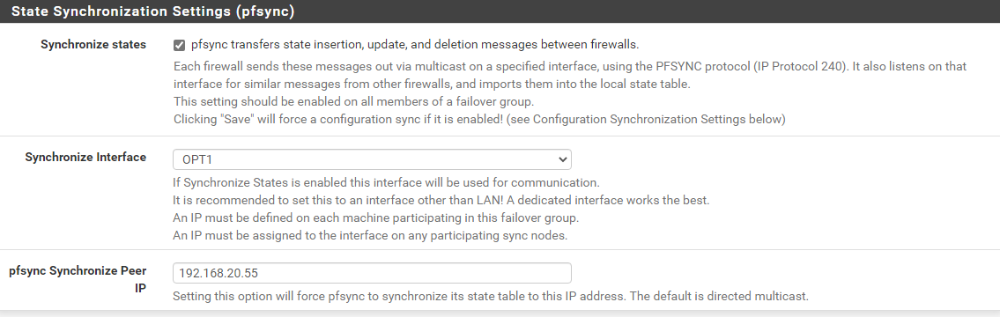
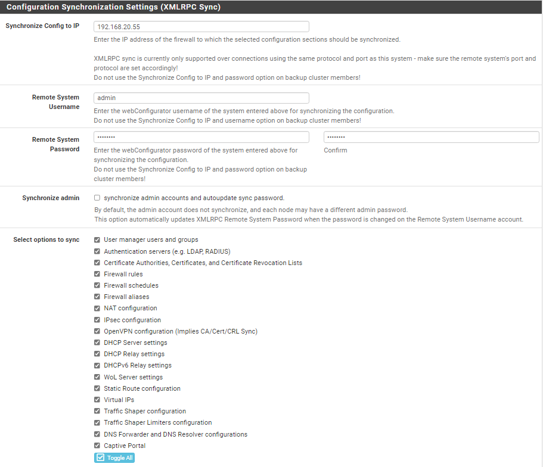
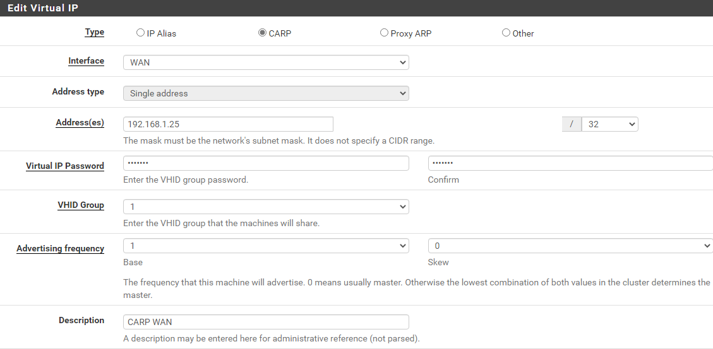

# Redondance VPN

Le redondance permet d'assurer le fonctionnement du VPN. Si l'un des 2 pfSense tombe en panne, le second prendra le
relais. Nous allons donc synchroniser la configuration des 2 pfSense.

Nous allons passer par l'interface web via l'IP des différents pfSense.

Rappel : 
- **pfSense 1** : 192.168.15.54 
- **pfSense 2** : 192.168.15.55

Nous allons également faire en sorte que toutes les configurations effectuées sur le pfSense 1 se font également sur le 2eme. Nous auront donc qu'à modifier le premier pfSense.

## Synchronisation des paramètres

Allez sur l'interface web du pfSense 1.

**System** -> **High Avail. Sync.**

- Il faut cocher Synchronize States pour activer **pfsync**
- Pour la synchronisation des interfaces, il faut sélectionner **OPT1**
- **pfsync Synchronize Peer IP** : 192.168.20.55 (C'est l'IP de notre carte OPT1)

### Configuration de XMLRPC Sync

- **Synchronize Config to IP** : 192.168.20.55 (C'est l'IP de notre carte OPT1)
- **Remote system username** : admin
- **Remote system password** : pfsense
- **Select options to sync** : Cochez **_toggle all_** afin de synchroniser toutes les options.

## Configuration des adresses IP virtuelles

**Firewall** -> **Virtual IPs**

Il faut ajouter une nouvelle IP virtuelle pour la carte **WAN** et **OPT2** en utilisant le protocole **CARP**.

**_WAN_** : 
- **IP Address** : 192.168.1.25
- **Password** : pfsense
- **Skew** : 0

**_OPT1 (DMZ)_** : 
- **IP Address** : 192.168.25.25
- **Password** : pfsense
- **Skew** : 0

