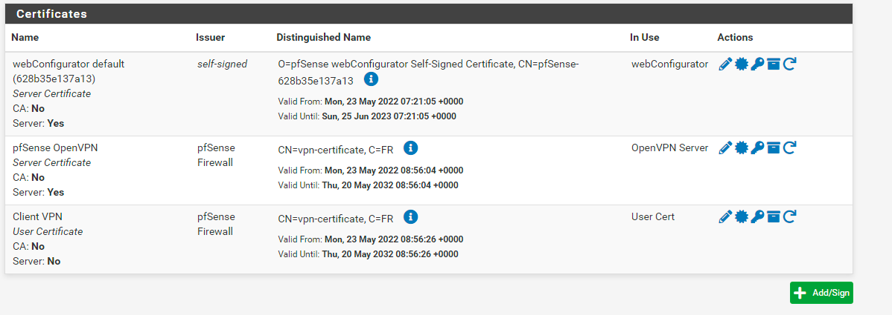

# Certificats

## Autorité de certification

**System** -> **Cert. Manager** -> **CAs**

- **Descriptive Name** : Client VPN
- **Certificate Authority** : pfSense Firewall
- **Common Name** : vpn-certificate
- **Certificate Type** : User Certificate

## Création d'un utilisateur

**System** -> **User Manager** -> **Users**

- **Username** : client-openvpn
- **Password** : pfsense
- **Full Name** : Client VPN

## Lier l'utilisateur avec le certificat

Il faut retourner dans la configuration de l'utilisateur précedemment créé.

- **Method** : Choose an existing certificate
- **Descriptive Name** : client-openvpn
- **Existing Certificates** : Client VPN

Pour que la réplication fonctionne avec les interfaces, nous devons allez dans :

**Interface** -> **WAN**

Puis il faut décocher **Block private networks** et **Block bogon networks**
