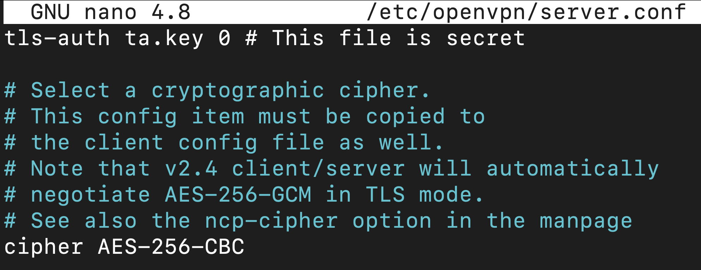
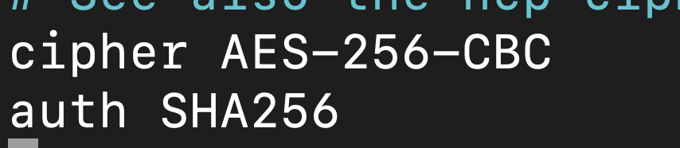
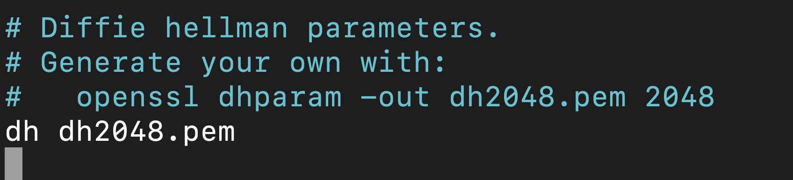
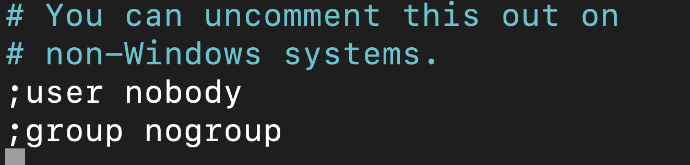
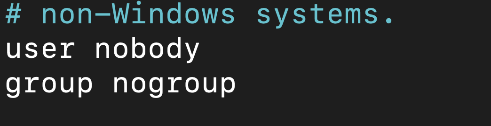
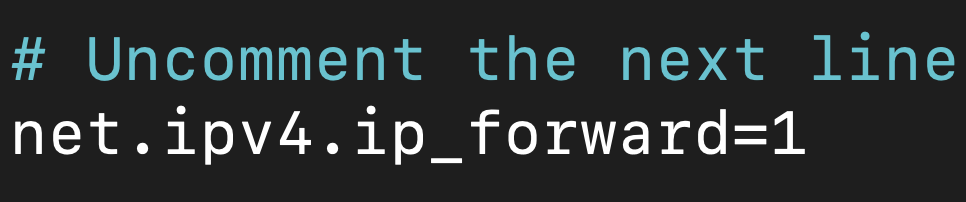
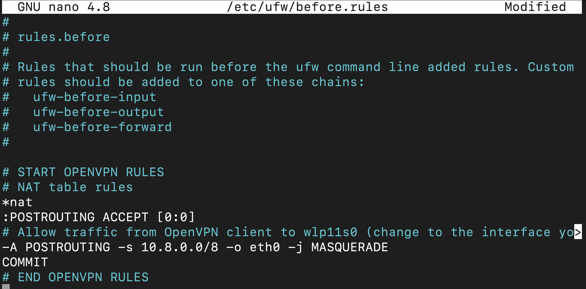
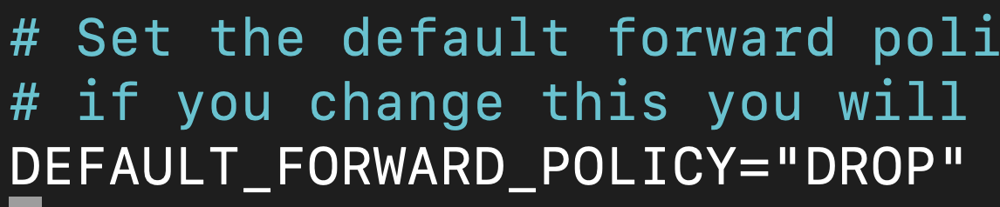
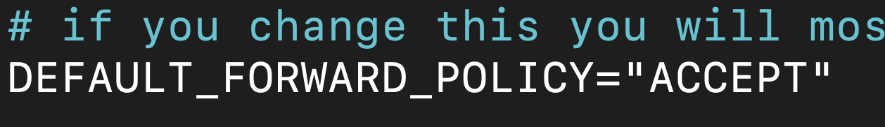

# OpenVPN

[](https://travis-ci.org/joemccann/dillinger)

## Configuration du service OpenVPN

#### _Maintenant que les certificats et les clés de votre client et de votre serveur ont été générés, on peut commencer la configuration d’OpenVPN._

On va copier un exemple de fichier de configuration OpenVPN dans le répertoire de configuration et l’utiliser comme base pour l’installation.

````shell
sudo cp /usr/share/doc/openvpn/examples/sample-config-files/server.conf.gz /etc/openvpn/
sudo gzip -d /etc/openvpn/server.conf.gz
sudo nano /etc/openvpn/server.conf
````
Vérifiez que les lignes tls-auth et cipher sont décommentés



Rajoutez la directive ``auth SHA256``



Cherchez maintenant la directive dh



Si la clé est nommée dh2048.pem, renommez là dh.pem


Pour finir, décommentez les paramètres ``user`` et ``group`` en supprimant les ``;``





Il faut maintenant ajuster le paramètre transfert IP par défaut.

````shell
sudo nano /etc/sysctl.conf
````
Décommentez la ligne ``net.ipv4.ip_forward=1``



Exécutez maintenant la commande suivante

````shell
sudo sysctl -p
````

### Configuration du pare-feu

Il faut tout d’abord trouver l’interface de réseau public de votre machine

````shell
ip route | grep default
````


>Ici, l’interface se nomme eth0.*

Ouvrez maintenant le fichier``/etc/ufw/before.rules``

````shell
sudo nano /etc/ufw/before.rules
````

Rajoutez les lignes suivantes au début du fichier

````shell
# START OPENVPN RULES
# NAT table rules
*nat
:POSTROUTING ACCEPT [0:0]
# Allow traffic from OpenVPN client to wlp11s0 (change to the interface you discovered!)
-A POSTROUTING -s 10.8.0.0/8 -o wlp11s0 -j MASQUERADE
COMMIT
# END OPENVPN RULES
````



>Pensez à remplacer eth0 par le nom de votre interface réseau.

Vous devez indiquer à UFW d’autoriser également les paquets transmis par défaut

````shell
sudo nano /etc/default/ufw
````

Il faut changer la ligne DEFAULT_FORWARD_POLICY :
- ``DEFAULT_FORWARD_POLICY="DROP"``
- ``DEFAULT_FORWARD_POLICY="ACCEPT"``




Il faut maintenant autoriser le traffic vers OpenVPN

````shell
sudo ufw allow 1194/udp
sudo ufw allow OpenSSH
````

Chargez maintenant les modifications

````shell
sudo ufw disable
sudo ufw enable
````