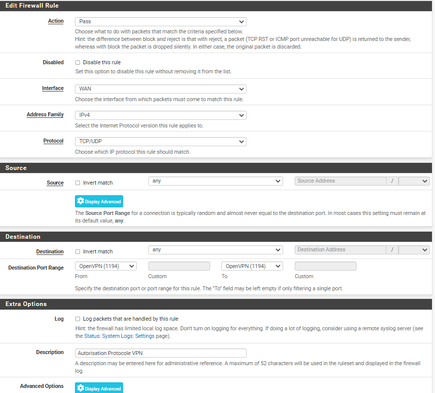
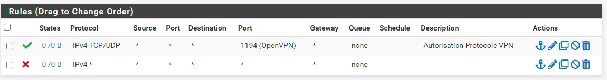
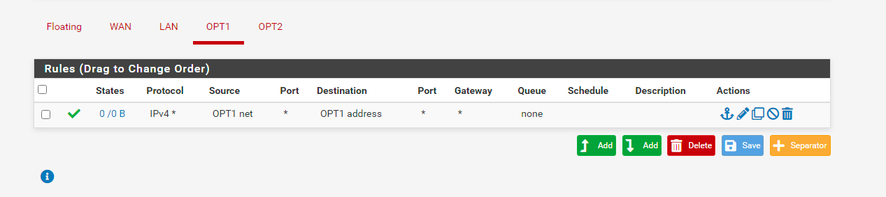
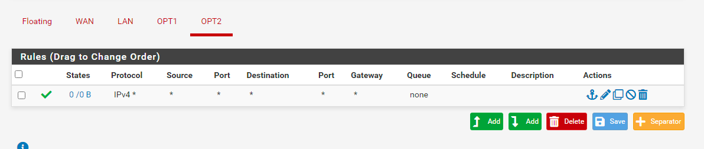

# Création des règles sur nos interfaces

Pour la configuration des règles, il faut se rendre dans **Firewall** -> **Rules**

Appuyez maintenant sur **add** pour créer une règle.

## Interface WAN

## Interface OPT1 (pfsync)

## Interface OPT2 (DMZ)

