# Installation et configuration d'OpenVPN

Il faut tout d'abord télécharger le package OpenVPN

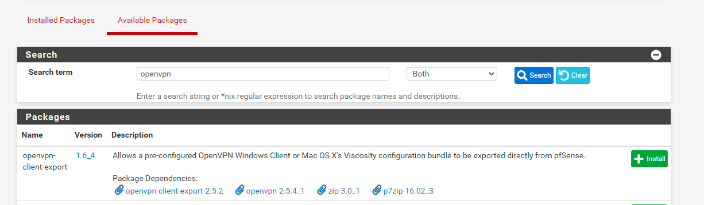

Allez dans **Wizards** -> **VPN** -> **OpenVPN**

- **Type of server** : Local User Access
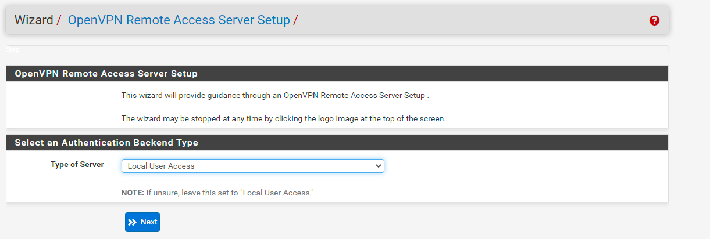

- **Certificate Authority** : pfSense FireWall
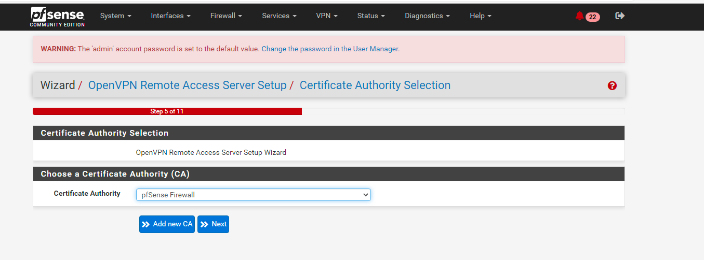

- **Certificate** : pfSense OpenVPN
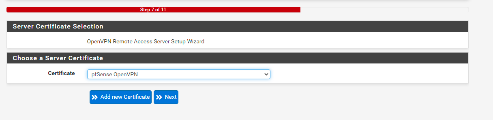

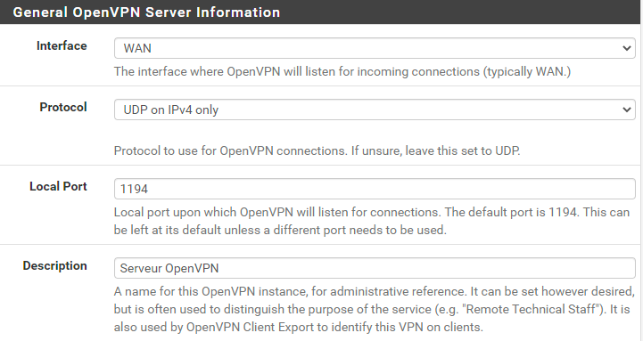

## Tunnel Settings

- **Tunnel Network** : 192.168.30.0/24
- Cochez la case **Inter-Client Communication**

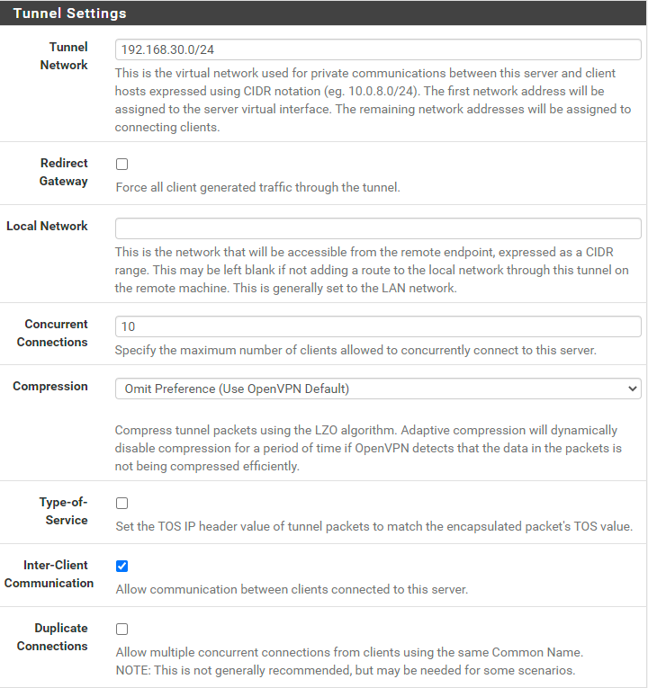

## Client Settings

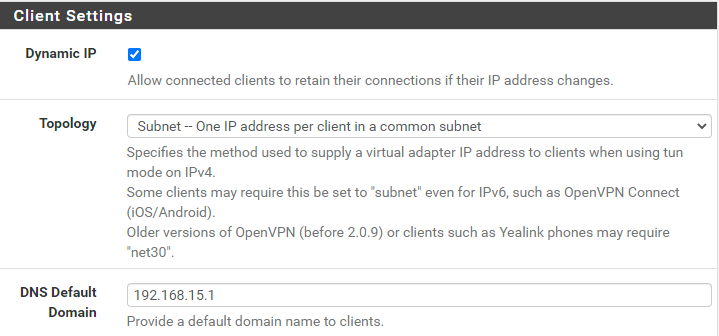

Il faut ensuite retourner dans **VPN** -> **OpenVPN** -> **Servers** pour modifier l'interface
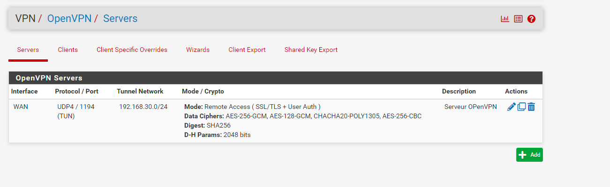

- **Server Mode** : Remote Access (SSL/TLS + User Auth)
- **Interface** : CARP WAN

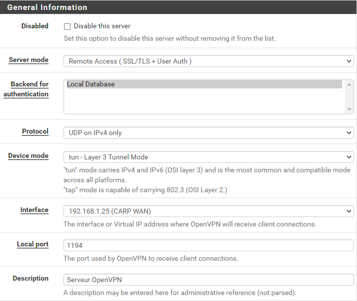

Vous avez maintenant accès à de nouvelles options.
- Cochez la case **Redirect IPv4 Gateway** dans **Tunnel Settings**

Pour finir, il faut télécharger le fichier de configuration. Pour cela, allez dans **VPN** -> **OpenVpn** -> **Client Export**.

**Host Name Resolution** -> **Interface IP Address**

Il faut maintenant exporter le **Most Clients** et y mettre l'adresse IP de votre machine server.

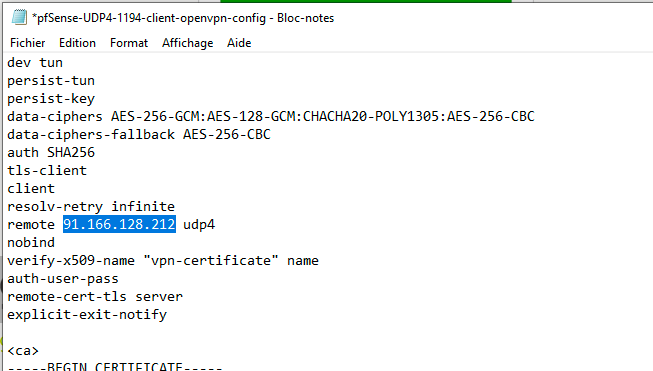

Pour finir, dans les paramètres de votre box internet, il faut y ajouter les règles suivantes.

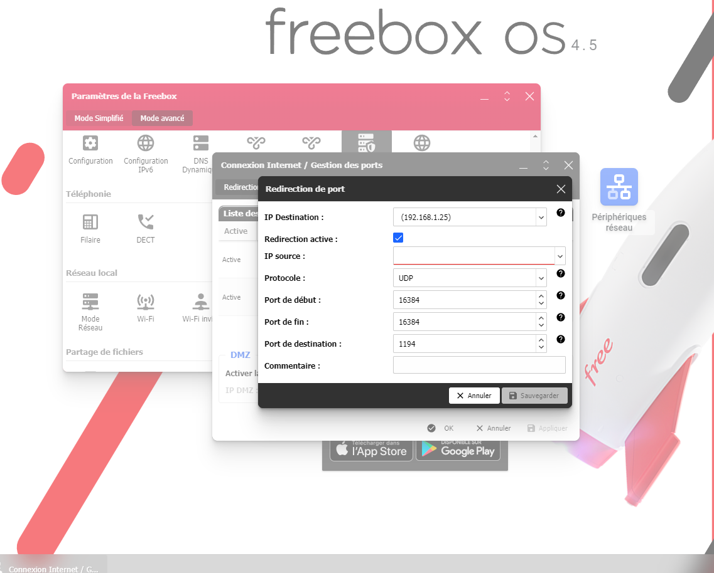
