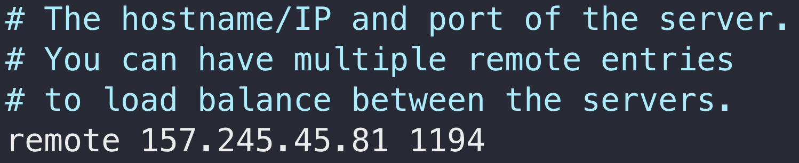
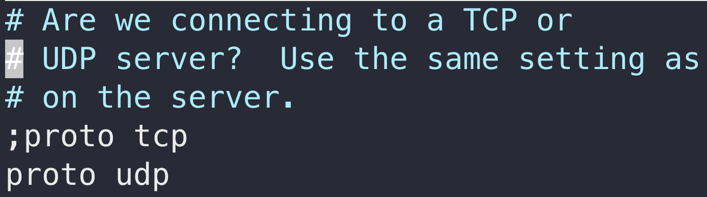
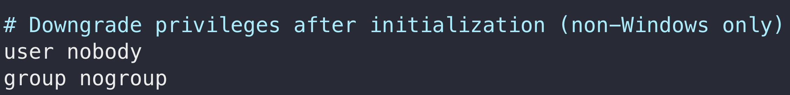
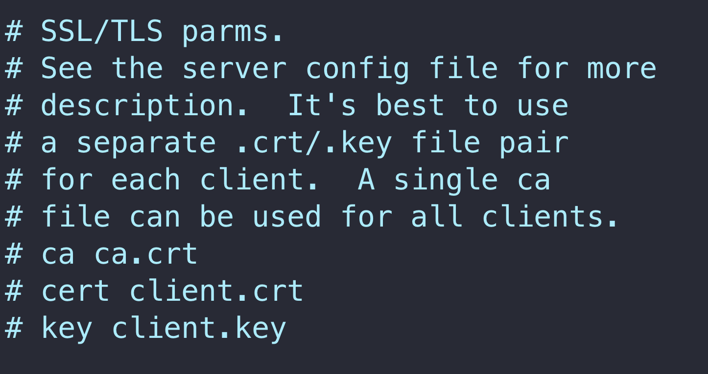
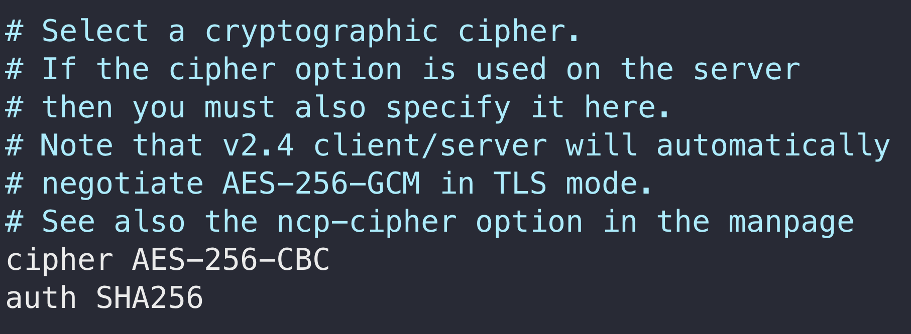
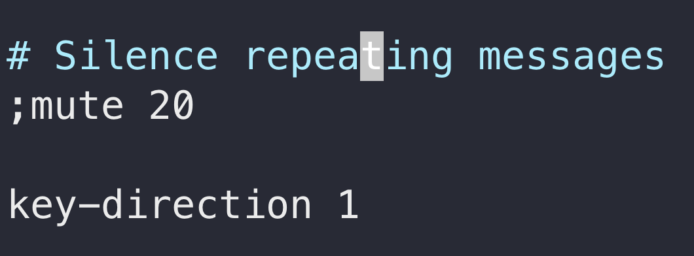
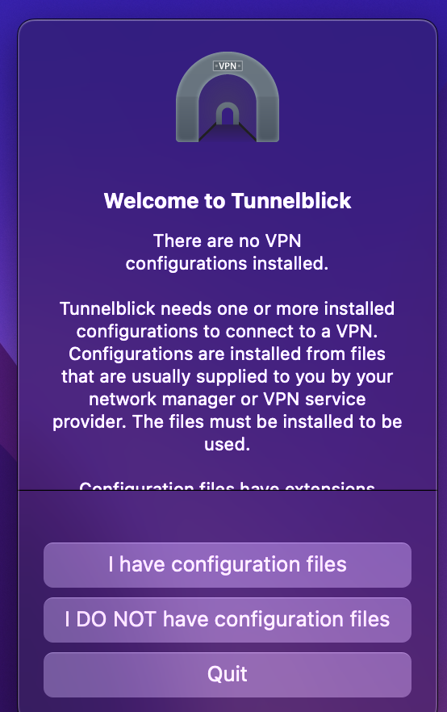

# OpenVPN

[](https://travis-ci.org/joemccann/dillinger)

## Infrastructure de configuration du client

#### _Pour la fin de l'installation, il suffit de s'occuper de la configuration client._


On va tout d’abord créé un nouveau dossier qui va contenir les fichiers de configuration du client.

````shell
mkdir -p ~/client-configs/files
````
On va maintenant copier un exemple de fichier de configuration afin d’avoir une base. On va ensuite l’éditer

````shell
cp /usr/share/doc/openvpn/examples/sample-config-files/client.conf ~/client-configs/base.conf
nano ~/client-configs/base.conf
````

Il faut mettre l’IP de votre serveur à la ligne remote



> Vérifier que le protocole utilisé est bien l’UDP



Il faut également décommenter les lignes user et group



Commentez les directives ca, cert et key car on ajoutera les certificats et les clés dans le dossier lui-même



Faire de même pour ``tls-auth``


Utilisez les mêmes paramètres ``cypher`` et ``auth`` que ceux que vous avez définis dans le fichier ``/etc/openvpn/server.conf``



Il faut ensuite ajouté key-direction n’importe où dans le fichier et régler le paramètre sur 1



Rajoutez ces lignes là à la fin du fichier

````shell
# script-security 2
# up /etc/openvpn/update-resolv-conf
# down /etc/openvpn/update-resolv-conf
````

>Vous décommenterez ces lignes si le client possède une machine sous Linux et qu’il possède un fichier ``/etc/openvpn/update-resolv-conf``

### Compilation du fichier de configuration de base avec les différents fichiers de certificat

````shell
nano ~/client-configs/make_config.sh
````

_Voici le contenu du script :_

````shell
#!/bin/bash

# First argument: Client identifier

KEY_DIR=~/client-configs/keys
OUTPUT_DIR=~/client-configs/files
BASE_CONFIG=~/client-configs/base.conf

cat ${BASE_CONFIG} \
    <(echo -e '<ca>') \
    ${KEY_DIR}/ca.crt \
    <(echo -e '</ca>\n<cert>') \
    ${KEY_DIR}/${1}.crt \
    <(echo -e '</cert>\n<key>') \
    ${KEY_DIR}/${1}.key \
    <(echo -e '</key>\n<tls-auth>') \
    ${KEY_DIR}/ta.key \
    <(echo -e '</tls-auth>') \
    > ${OUTPUT_DIR}/${1}.ovpn
````

Rendez le fichier exécutable en changeant les droits

````shell
chmod 700 ~/client-configs/make_config.sh
````

Déplacez les fichier ``client_name.crt`` et ``client_name.key`` dans le dossier ``~/client-configs`` puis éxécuter le script.

````shell
cd ~/client-configs
sudo ./make_config.sh client_name
````

Un fichier a maintenant été créé dans le dossiers ``files``

````shell
ls ~/client-configs/files

[Output]
client_name.ovpn
````

Déplacez maintenant ce fichier sur votre machine qui souhaitera utiliser le VPN

````shell
sftp root@157.245.45.81:client-configs/files/client_name.ovpn ~/
````


### Installation de la configuration client

#### _MacOS_

Téléchargez [https://tunnelblick.net/](https://tunnelblick.net/), ce client openVPN est gratuit et opensource

À la fin du téléchargement, tunneblick vous demandera si vous avez des fichiers de configurations, répondez que oui.



Ouvrez ensuite le Finder et double cliquez sur le fichier .ovpn