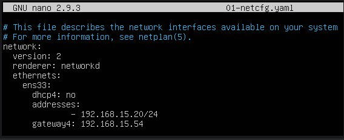
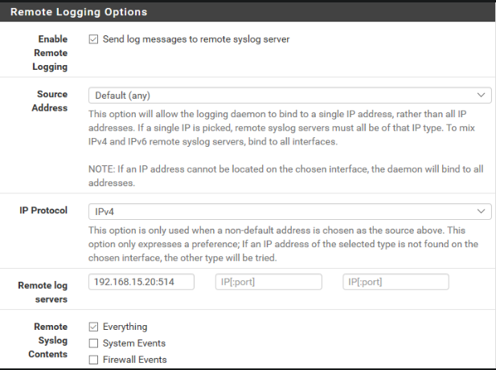
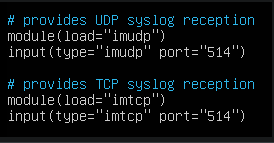
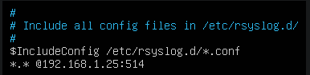
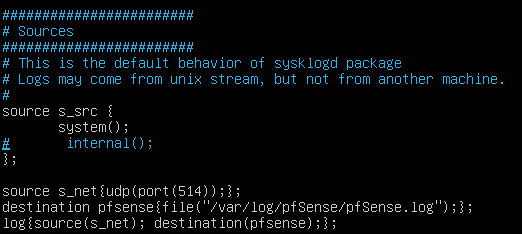
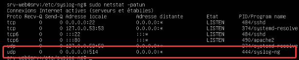
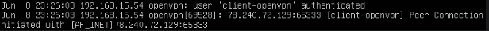
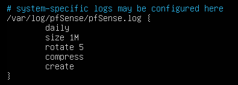
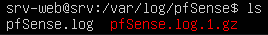

# Gestion des logs de connexion

### Rétention des logs

Pour gérer les logs de connexion, nous allons créer un nouveau serveur ubuntu que nous mettrons dans le réseau LAN.

Ce serveur va nous permettre de récupérer toutes les informations des logs utilisateurs.
Pour cela, nous allons suivre plusieurs étapes :

- Installation d’une VM ubuntu
- Installer syslog-ng avec la commande `sudo apt-get install syslog-ng`.
- Installer les outils net avec la commande `sudo apt-get install net-tools`.
- Nous allons ensuite configurer la carte réseau dans `/etc/netplan/01-netcfg.yaml`.

Il va ensuite falloir activer la gestion des logs à distance sur pfSense dans `Status → System logs → Settings`.

>Préciser l’ip du server log `192.168.15.20` suivi du port `514`.

De retour sur le serveur log, nous allons autoriser le port 514. Pour cela il va falloir aller `/etc/rsyslog.conf`.

- Décommenter les lignes concernant ``provides UDP syslog reception`` et ``provides TCP syslog reception``.

- Ajouter en dernière ligne l’IP virtuelle WAN suivi du port 514.

On va maintenant modifier le fichier de configuration syslog-ng dans `/etc/syslog-ng/syslog-ng.conf` et ajouter les lignes suivantes :

- Redémarrer le service rsyslog avec la commande `sudo systemctl restart rsyslog`.
- Faire de même pour syslog-ng
- Pour vérifier que le port 514 est bien disponible exécuter `sudo netstat -patun`

> Comme indiqué sur le screen tout est bon

- Créer le répertoire pfSense avec la commande `sudo mkdir /var/log/pfSense`
- Créer le fichier pfSense.log avec la commande `sudo touch /var/log/pfSense/pfSense.log`. Ce fichier contiendra tous les logs utilisateurs.
- Pour tester en direct et voir la connexion de l’utilisateur, exécuter la commande `tail-f /var/log/pfSense/pfSense.log`

### Archivage et purge des logs

Pour l’archivage et la purge des logs, nous allons utiliser ``Logrotate`` qui permet de limiter la taille des fichiers journaux.

``Logrotate`` est normalement installé par défaut sur le système.

- Taper la commande ``Logrotate`` pour vérifier qu’il est bien installé.
- Modifier le fichier de configuration dans `/etc/logrotate.conf`.
- Spécifier le chemin vers lequel on souhaite enregistrer les logs. `/var/log/pfSense/pfSense.log`
- Mettre les paramètres souhaités pour la rotation des logs.

- Logrotate va générer une rotation à chaque fois que la taille du fichier atteint 1 Mo et lors de la 6e rotation, il supprimera le fichier le plus ancien.
####
- Même si le fichier n’atteint pas 1 Mo, Logrotate effectuera toujours une rotation chaque jour et une fois qu’il atteint 5 rotations (5 jours) alors il supprimera le fichier archivé le plus ancien.
####
- Comme le paramètre size prend la priorité sur le rotate 5, tant que le fichier n’atteint pas 1 Mo, aucune rotation ne se fera. Une fois que le fichier atteint la taille de 1Mo, une rotation sera effectuée. Une fois les 5 rotations atteintes, le plus ancien fichier archivé sera supprimé.
####
- Pour tester manuellement, executer la commande `logrotate -f /etc/logrotate.conf`
####
- Vérifier ensuite dans le dossier `/var/log/pfSense` que l’archive à bien été ajouté.

