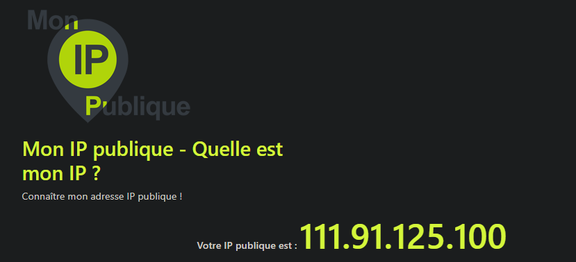
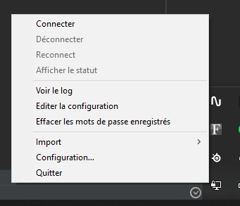
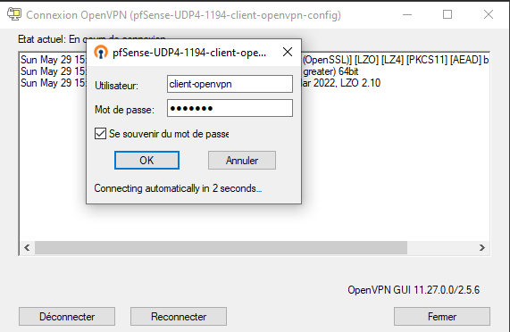
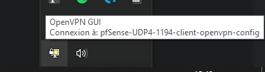
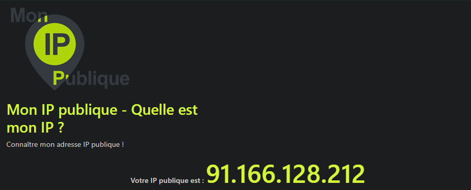

# Demo VPN

### Demo sous iso Windows

Tout d'abord on trouve notre adresse ip

Puis on se connecte à OpenVPN GUI après l'avoir configuré

On se connecte avec le compte crée précédemment dans le firewall

Lorsque la connexion est effectuée on retourne vérifier l'adresse ip :

L'adresse ip a changé, le VPN fonctionne

> Cette démo est à titre démonstratif et ne fait pas partie de la configuration nécessaire au VPN

